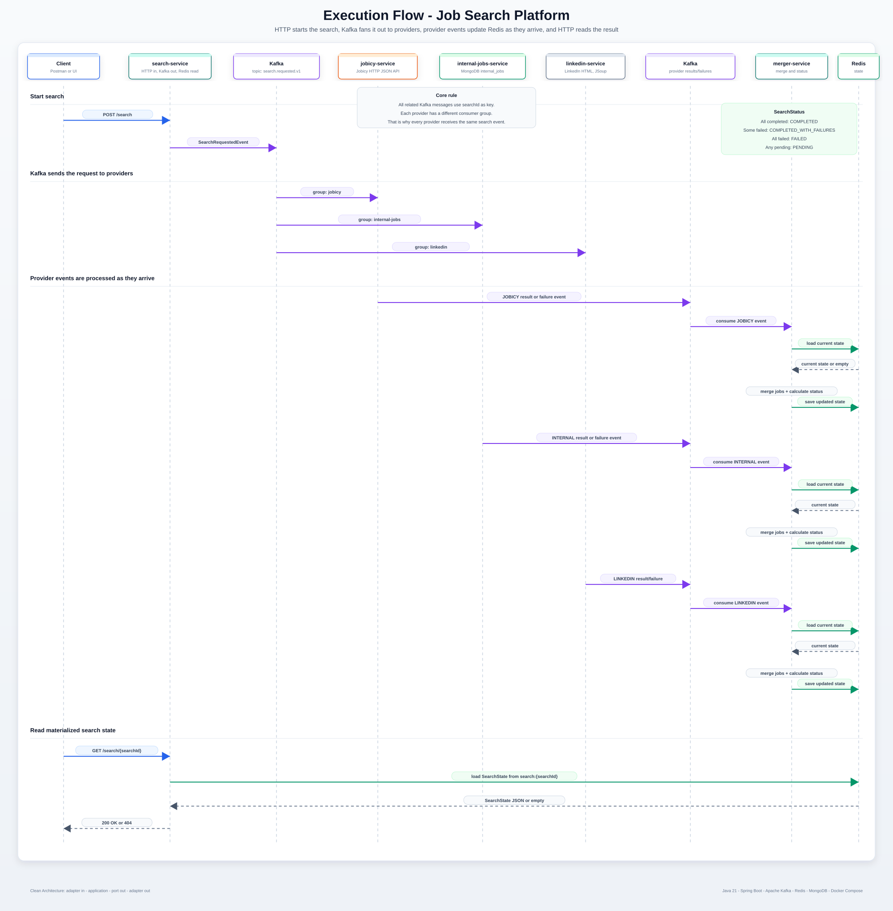
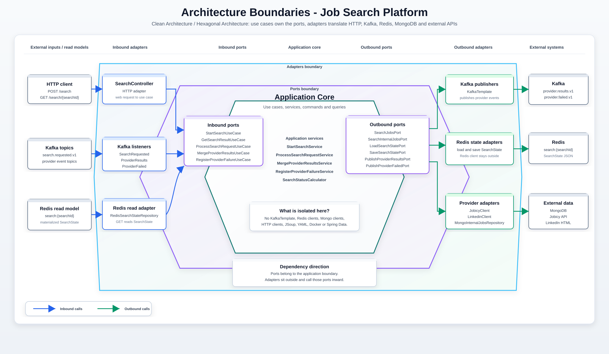

# Job Search Platform

Microservices job search platform built with Java 21, Spring Boot, Apache Kafka, Redis, MongoDB and Docker Compose.

The system receives a search request, publishes it to Kafka, lets multiple providers process it asynchronously, merges the provider responses, stores the current search state in Redis, and exposes the result through an HTTP API. Jobicy and LinkedIn provider calls are protected with Resilience4j circuit breakers and cached with Spring Cache backed by Redis.



## Table of Contents

- [SearchState Example](#searchstate-example)
- [Quick Start](#quick-start)
- [Tech Stack](#tech-stack)
- [API](#api)
- [OpenAPI / Swagger UI](#openapi--swagger-ui)
- [Architecture](#architecture)
- [Resilience](#resilience)
- [Kafka](#kafka)
- [Modules](#modules)
- [Docker Services](#docker-services)
- [Localhost vs Docker Service Names](#localhost-vs-docker-service-names)
- [Local Debugging](#local-debugging)
- [Spring Profiles](#spring-profiles)
- [Running Services With Maven](#running-services-with-maven)
- [Health Checks](#health-checks)
- [Validated Flows](#validated-flows)

## SearchState Example

`merger-service` stores the current search state in Redis. `search-service` reads that state when the client calls `GET /search/{searchId}`. `updatedAt` shows when the Redis state was last written by `merger-service`. `jobCount` is derived from the current `jobs` list.

Example:

```json
{
  "searchId": "ab739095-15b7-4c82-9baa-fdcbb1fdaeae",
  "status": "COMPLETED",
  "updatedAt": "2026-08-07T10:14:05.959677873Z",
  "jobCount": 3,
  "jobs": [
    {
      "title": "Spring Boot Developer",
      "company": "Northwind Systems",
      "location": "Remote",
      "url": "https://internal.example.com/jobs/spring-boot",
      "source": "INTERNAL"
    },
    {
      "title": "Java Developer",
      "company": "Virtusa",
      "location": "Doha, Doha, Qatar",
      "url": "https://qa.linkedin.com/jobs/view/java-developer-at-virtusa-4435652510",
      "source": "LINKEDIN"
    },
    {
      "title": "Java Backend Engineer",
      "company": "Binance",
      "location": "APAC",
      "url": "https://jobicy.com/jobs/142198-java-backend-engineer-ai-llm-chatbot-customer-service",
      "source": "JOBICY"
    }
  ],
  "providers": {
    "JOBICY": "COMPLETED",
    "INTERNAL": "COMPLETED",
    "LINKEDIN": "COMPLETED"
  },
  "failures": [],
  "expectedProviders": [
    "JOBICY",
    "INTERNAL",
    "LINKEDIN"
  ]
}
```

## Quick Start

Prerequisites:

```text
Java 21
Docker Desktop
Maven wrapper included in the repository
```

Build all modules:

```powershell
.\mvnw.cmd clean package
```

Start the complete platform:

```powershell
docker compose up -d --build
```

Start a search:

```http
POST http://localhost:8081/search
Content-Type: application/json

{
  "query": "java",
  "location": "Remote",
  "remote": true
}
```

Read the result:

```http
GET http://localhost:8081/search/{searchId}
```

The search flow is asynchronous. A `GET` immediately after `POST` can return 404 until the merger receives the first provider event and creates the Redis state.

## Tech Stack

| Area | Technology |
| --- | --- |
| Runtime | Java 21 |
| Framework | Spring Boot 4.1.0 |
| Build | Maven multi-module |
| JSON serialization | Jackson 3 |
| API documentation | springdoc-openapi / Swagger UI |
| Messaging | Apache Kafka |
| State read model | Redis |
| Provider cache | Spring Cache with Redis for Jobicy and LinkedIn |
| Resilience | Resilience4j circuit breakers for Jobicy and LinkedIn |
| Internal data source | MongoDB |
| External HTTP source | Jobicy |
| External HTML source | LinkedIn guest jobs endpoint parsed with JSoup |
| Local runtime | Docker Compose |
| Local UIs | Kafbat / Kafka UI, RedisInsight, Mongo Express |

## API

Start a search:

```http
POST http://localhost:8081/search
Content-Type: application/json

{
  "query": "java",
  "location": "Remote",
  "remote": true
}
```

Response:

```json
{
  "searchId": "..."
}
```

HTTP status:

```text
202 Accepted
```

Get search result:

```http
GET http://localhost:8081/search/{searchId}
```

Successful response:

```json
{
  "searchId": "...",
  "status": "COMPLETED",
  "updatedAt": "2026-08-07T10:14:05.959677873Z",
  "jobCount": 0,
  "jobs": [],
  "providers": {
    "JOBICY": "COMPLETED",
    "INTERNAL": "COMPLETED",
    "LINKEDIN": "COMPLETED"
  },
  "failures": [],
  "expectedProviders": [
    "JOBICY",
    "INTERNAL",
    "LINKEDIN"
  ]
}
```

If the state does not exist yet:

```json
{
  "message": "Search not found",
  "searchId": "..."
}
```

HTTP status:

```text
404 Not Found
```

## OpenAPI / Swagger UI

`search-service` exposes OpenAPI documentation for the public HTTP API.

Swagger UI:

```text
http://localhost:8081/swagger-ui.html
```

OpenAPI JSON:

```text
http://localhost:8081/v3/api-docs
```

The generated documentation includes `POST /search`, `GET /search/{searchId}`, request/response schemas and example responses.

## Architecture

The project follows Clean Architecture / Uncle Bob boundaries.



Main rule:

```text
adapter in -> application -> port out -> adapter out -> external world
```

The application layer does not depend on Kafka, Redis, MongoDB, HTTP clients, Docker, YAML, Spring Data repositories or `KafkaTemplate`.

External details live in adapters:

```text
HTTP controllers
Kafka listeners
Kafka publishers
Redis repositories
MongoDB repositories
RestClient clients
JSoup HTML parser
Spring Cache
Docker Compose
application.yml
```

Shared data that crosses service boundaries lives in `job-search-contracts`.

## Resilience

External providers are isolated behind circuit breakers.

`jobicy-service` and `linkedin-service` use Resilience4j to prevent repeated slow or failing calls from blocking Kafka consumers. When an external API becomes unhealthy, the circuit breaker opens and subsequent calls fail fast.

Those failures are not propagated as unhandled listener errors. They are translated into `ProviderFailedEvent` messages, so the asynchronous flow remains controlled and `merger-service` can update the Redis `SearchState`.

Current local-friendly thresholds:

```text
sliding-window-size: 5                          # Evaluates the last 5 calls.
minimum-number-of-calls: 5                      # Waits for at least 5 calls before calculating the failure rate.
failure-rate-threshold: 50                      # Opens the circuit when 50% or more of the evaluated calls fail.
wait-duration-in-open-state: 10s                # Keeps the circuit open for 10 seconds before trying again.
permitted-number-of-calls-in-half-open-state: 2 # Allows 2 trial calls while checking if the provider recovered.
```

## Kafka

Topics:

```text
search.requested.v1
provider.results.v1
provider.failed.v1
```

Consumer groups:

```text
jobicy-service
internal-jobs-service
linkedin-service
merger-service
```

Events:

```text
SearchRequestedEvent
  searchId
  criteria

ProviderResultsEvent
  searchId
  provider
  jobs

ProviderFailedEvent
  searchId
  provider
  failureType
  message
```

All related Kafka messages use `searchId` as key.

## Modules

```text
job-search-platform
+-- job-search-contracts
+-- search-service
+-- jobicy-service
+-- internal-jobs-service
+-- linkedin-service
+-- merger-service
```

| Module | Port | Responsibility |
| --- | --- | --- |
| `job-search-contracts` | - | Plain Java library with Kafka events, shared DTOs, provider enums, `SearchState` and `SearchStateKeys`. |
| `search-service` | 8081 | Exposes `POST /search`, publishes search requests to Kafka and reads Redis state for `GET /search/{searchId}`. |
| `jobicy-service` | 8082 | Consumes search requests, calls Jobicy HTTP API with a circuit breaker, caches provider results with Spring Cache and Redis, and publishes provider results or failures. |
| `internal-jobs-service` | 8084 | Consumes search requests, reads active jobs from MongoDB collection `internal_jobs` and publishes provider results or failures. |
| `linkedin-service` | 8087 | Consumes search requests, calls LinkedIn guest jobs endpoint with a circuit breaker, parses HTML with JSoup, caches provider results with Spring Cache and Redis, and publishes provider results or failures. |
| `merger-service` | 8083 | Consumes provider results/failures, calculates `SearchStatus`, updates `updatedAt` and stores `SearchState` in Redis. |

## Docker Services

Docker Compose includes infrastructure and all Java microservices.

Redis is used both as the `SearchState` read model and as the Spring Cache backend for Jobicy and LinkedIn provider results.

Infrastructure:

```text
Kafka
Kafbat / Kafka UI
Redis
RedisInsight
MongoDB
Mongo Express
```

Java services:

```text
search-service
jobicy-service
merger-service
internal-jobs-service
linkedin-service
```

Ports:

| Port | Service |
| --- | --- |
| 8081 | search-service |
| 8082 | jobicy-service |
| 8083 | merger-service |
| 8084 | internal-jobs-service |
| 8085 | Kafbat / Kafka UI |
| 8086 | Mongo Express |
| 8087 | linkedin-service |
| 5540 | RedisInsight |
| 6379 | Redis |
| 9092 | Kafka external listener |
| 27017 | MongoDB |

Useful UIs:

```text
Kafka UI:      http://localhost:8085
RedisInsight:  http://localhost:5540
Mongo Express: http://localhost:8086
```

## Localhost vs Docker Service Names

From the host machine:

```text
Kafka  -> localhost:9092
Redis  -> localhost:6379
Mongo  -> localhost:27017
API    -> localhost:8081
```

From inside Docker Compose:

```text
Kafka  -> kafka:29092
Redis  -> redis:6379
Mongo  -> mongodb:27017
```

The `application.yml` files keep local defaults for running from IntelliJ or Maven.

Docker Compose overrides those values with environment variables:

```yaml
SPRING_KAFKA_BOOTSTRAP_SERVERS: kafka:29092
SPRING_DATA_REDIS_URL: redis://redis:6379
SPRING_MONGODB_URI: mongodb://mongodb:27017/job-search-platform
```

## Local Debugging

Use this mode when debugging the Java services from IntelliJ.

Start only Kafka, Redis, MongoDB and UIs:

```powershell
docker compose up -d kafka kafka-ui redis redis-insight mongodb mongo-express
```

Then run the Java services from IntelliJ or Maven.

If all services are already running in Docker and you want to debug locally, stop only the Java containers:

```powershell
docker compose stop search-service jobicy-service merger-service internal-jobs-service linkedin-service
```

## Spring Profiles

`jobicy-service` includes a local Spring Profile named `local-http-logging`.

When this profile is active, `LocalHttpLoggingConfig` registers a `RestClientCustomizer` that logs outgoing Jobicy HTTP requests before they are executed. This is meant for local debugging and is not enabled by Docker Compose.

Run `jobicy-service` with local HTTP logging:

```powershell
.\mvnw.cmd -f .\jobicy-service\pom.xml spring-boot:run "-Dspring-boot.run.arguments=--spring.profiles.active=local-http-logging"
```

Run it normally, without the profile:

```powershell
.\mvnw.cmd -f .\jobicy-service\pom.xml spring-boot:run
```

## Running Services With Maven

Run one service from the project root:

```powershell
.\mvnw.cmd -f .\search-service\pom.xml spring-boot:run
.\mvnw.cmd -f .\linkedin-service\pom.xml spring-boot:run
```

Pattern:

```powershell
.\mvnw.cmd -f .\<module-name>\pom.xml spring-boot:run
```

Compile all modules:

```powershell
.\mvnw.cmd clean package
```

Compile one module with its dependencies:

```powershell
.\mvnw.cmd -pl <module-name> -am clean package
```

## Health Checks

```http
GET http://localhost:8081/actuator/health
GET http://localhost:8082/actuator/health
GET http://localhost:8083/actuator/health
GET http://localhost:8084/actuator/health
GET http://localhost:8087/actuator/health
```

## Validated Flows

Validated flows:

```text
JOBICY + INTERNAL + LINKEDIN completed
  -> overall status COMPLETED

INTERNAL failed while JOBICY and LINKEDIN completed
  -> overall status COMPLETED_WITH_FAILURES

LINKEDIN failed while JOBICY and INTERNAL completed
  -> overall status COMPLETED_WITH_FAILURES
```

The full Docker Compose flow has been tested with all microservices running in Docker.
